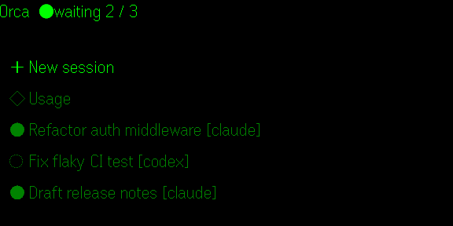
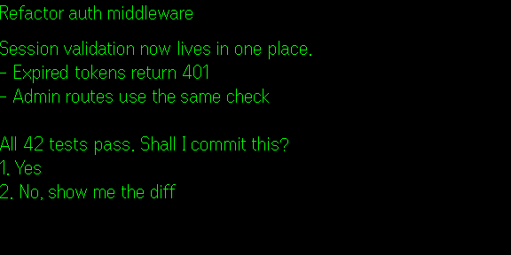
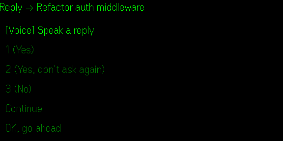
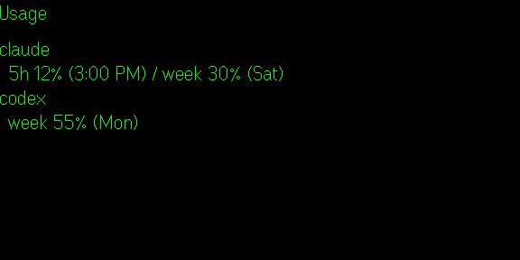
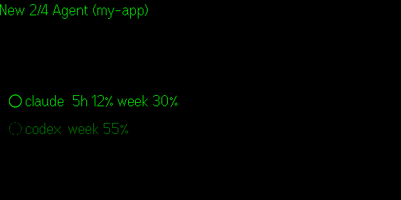
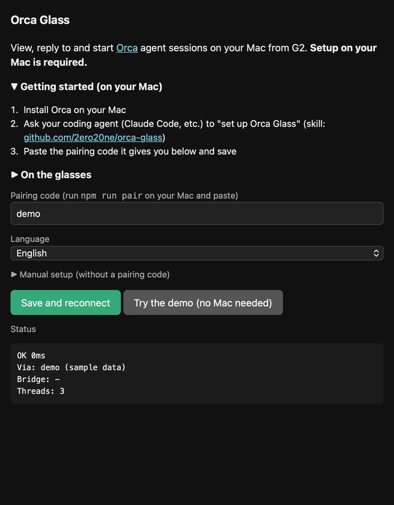

# Orca Glass

[English](README.md)

**Even Realities G2** から、[Orca](https://github.com/stablyai/orca) のエージェントを見る・返信する・起動するアプリです。外出先でも使えます。

- **スレッド** — Claude / Codex のセッション一覧と、入力待ちかどうか、最新の回答(ツールの出力や思考中の表示は省きます)
- **返信** — 定型文をワンタップで。**話して返信**することもでき、Mac の whisper.cpp で文字にしてグラスで確認してから送ります
- **新規セッション** — 作業場所・エージェント・モデル・最初の指示を選んで起動
- **使用量** — プロバイダーごとの5時間枠・週枠
- **日本語 / English** — スマホの言語に合わせて自動で切り替え(手動でも選べます)。定型文・指示・音声認識も切り替わります

| スレッド一覧 | 最新の回答 | 返信 |
| --- | --- | --- |
|  |  |  |
| **使用量** | **新規セッション** | **スマホの設定画面** |
|  |  |  |

<sub>グラスの画面(576×288)は、アプリ内のデモ(架空のデータ)で撮影しています。アプリの「デモを試す」で、Mac がなくても同じ画面を確認できます。</sub>

```
G2 ⇄ Even アプリ(Orca Glass) ⇄ Cloudflare Quick Tunnel ⇄ Mac の中継サーバ ⇄ orca CLI
                          ↑ トンネルの URL は ntfy.sh で知らせる(トークンで署名)
```

## セットアップ

1. スマホに Even Hub から **Orca Glass** を入れる
2. お使いのコーディングエージェントにセットアップ用スキルを入れて、「Orca Glass をセットアップして」と頼む
   - Orca: [Orca のスキル共有リンク](https://share.onorca.dev/skills/share/shr_d60bfc61c56982da57cd656cd0314f5d253ee99a77539873)から入れる
   - Claude Code: `/plugin marketplace add 2ero20ne/orca-glass` → `/plugin install orca-glass@orca-glass`
   - その他のエージェント: `git clone https://github.com/2ero20ne/orca-glass.git ~/orca-glass` して、`skills/orca-glass-setup/SKILL.md` を読ませる
3. エージェントが出した「接続コード」を、スマホの Orca Glass に貼り付ける。これで完了です。トンネルの URL が変わっても自動でつながり直します。

見てみるだけなら、アプリの **「デモを試す」** を押してください。Mac は不要です。

手動で入れる場合: `sh scripts/doctor.sh` → `npm start` → `npm run pair`

## Mac の外に出るもの

| 送り先 | 送るもの |
| --- | --- |
| Cloudflare Quick Tunnel(`*.trycloudflare.com`) | 中継サーバとの通信。すべての操作にトークンが必要。無料・アカウント不要だが、**稼働の保証はありません** |
| ntfy.sh(推測できない名前の置き場) | トンネルの URL・時刻・署名(HMAC)だけ。**トークンは送りません**。署名が合わない URL はアプリが無視します |
| どこにも送らない | 音声。whisper.cpp で Mac の中だけで文字にします |

エージェントに送られるのは、定型文と、グラスで確認した文章だけです。

## 必要なもの

macOS、Node.js 20 以上、Orca(起動中)、`cloudflared`。音声返信を使う場合は `whisper-cpp` と約550MBのモデル(`sh scripts/get-model.sh`)。

## プライバシーポリシー

https://www.2ero20ne.com/orca-glass/privacy

## ライセンス

MIT
